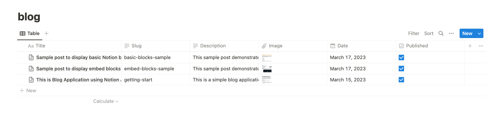
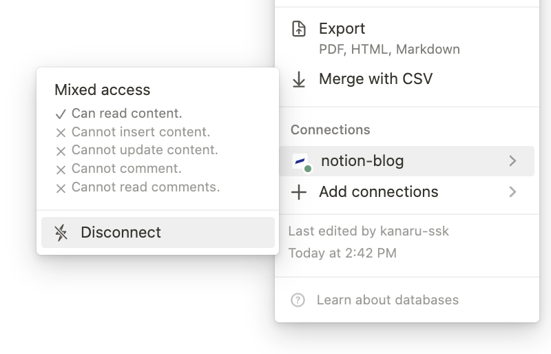

# Blog Application using Notion API, Next.js, TypeScript, and Tailwind CSS

This is a simple blog application built with Next.js, TypeScript, Notion API, and Tailwind CSS. The application fetches data from a Notion database using the Notion API and displays the data on the frontend. It is designed to be easily customizable and extendable, so you can use it as a starting point for your own blog or website.

## Demo Page

https://notion-blog.kanaru.jp/

## Getting Started

To get started with the project, you will need to follow these steps:

1. Clone the repository:

```
git clone https://github.com/kanaru-ssk/notion-blog.git
```

2. Install dependencies:

```
cd notion-blog
pnpm install
```

3. Set up Notion API:

   1. Create a new Notion account if you don't have one already.
   2. Get your Notion API key by following the [official guide](https://developers.notion.com/docs/create-a-notion-integration).
   3. Create a new database and add the following properties: Title, Slug, Description, Image, Date, and Published.
      
   4. Share the database with your integration.
      

4. Set environment variables

```
// .env.local
NEXT_PUBLIC_DOMAIN="http://localhost:3000"
NOTION_TOKEN="your-notion-api-key"
NOTION_DATABASE="your-notion-database-id"
```

5. Start the development server:

```
pnpm dev
```

6. Open the application in your browser:

```
http://localhost:3000
```

## Features

The application comes with the following features:

- Display list of blog posts fetched from a Notion database.
- Single blog post page.

## Customization

You can customize the application to fit your own needs by:

- Updating the styling with Tailwind CSS.
- Changing the Notion database schema to fit your own content.
- Adding new pages and components to the application.

## License

This project is licensed under the MIT License. See [the LICENSE file](LICENSE) for more information.
